# Latent non-Gaussian models with ngvb

``` r

library(ngvb)
library(INLA)     # ngvb uses INLA as a backend; attach it to call inla() directly
```

## Overview

A latent Gaussian model (LGM), the workhorse of R-INLA, places a
Gaussian prior on a latent field: a random walk, an autoregression, a
spatial effect, or a set of random effects. That prior is convenient but
rigid, because it assumes Gaussianity everywhere. Real data often break
this assumption in just a few places, such as a sudden jump in a time
series, one outlying subject, a sharp boundary between regions, or a
local hotspot in space. A Gaussian model then has to compromise. It
either over-smooths the interesting feature or inflates the variance
everywhere to accommodate it.

`ngvb` relaxes that single assumption. It keeps everything you already
have, the same INLA model and the same code, and replaces the Gaussian
driving noise with a heavier-tailed one. The result adds flexibility
only where the data ask for it and falls back to the Gaussian model
everywhere else. Two functions do the work, and both take an ordinary
`inla` fit that was run with `control.compute = list(config = TRUE)`:

- `ng.check(fit)` asks whether you should relax the Gaussian assumption,
  and where.
- `ngvb(fit)` fits the non-Gaussian extension.

## The model in one paragraph

Every LGM writes its latent field $`\mathbf x`$ through a model-specific
dependency matrix $`\mathbf D(\boldsymbol\theta)`$ that turns
$`\mathbf x`$ into independent Gaussian increments,
``` math
\mathbf D(\boldsymbol\theta)\,\mathbf x \;\overset{d}{=}\; \boldsymbol\Lambda,
\qquad \Lambda_i \sim N(0,\,h_i).
```
For a random walk $`\Lambda_i=x_{i}-x_{i-1}`$, for an autoregression
$`\Lambda_i=x_i-\rho x_{i-1}`$, and so on. The non-Gaussian model keeps
the same $`\mathbf D`$ but lets each increment have its own variance
$`V_i`$,
``` math
\Lambda_i \mid V_i \sim N(0,\,V_i),\qquad
  V_i \sim \mathrm{IG}(h_i,\,\eta^{-1}h_i^2),\qquad E[V_i]=h_i .
```
The mixing variables $`\mathbf V`$ carry the local flexibility. Where
$`V_i=h_i`$ the model is Gaussian, and where $`V_i`$ is inflated the
increment is allowed to be unusually large. A single non-Gaussianity
parameter $`\eta\ge 0`$ controls how far $`\mathbf V`$ may stray from
$`\mathbf h`$, and $`\eta=0`$ is exactly the Gaussian model. Conditional
on $`\mathbf V`$ the field is still Gaussian, with precision
``` math
\mathbf Q(\boldsymbol\theta,\mathbf V)=\mathbf D(\boldsymbol\theta)^\top\,
   \mathrm{diag}(1/\mathbf V)\,\mathbf D(\boldsymbol\theta).
```
`ngvb` fits the model with a short variational-Bayes loop that
repeatedly calls INLA with $`\mathbf V`$ fixed and then updates
$`\mathbf V`$ and $`\eta`$. The prior on $`\eta`$ is an exponential (a
penalised-complexity prior with rate `alpha.eta`, default $`2`$) that
shrinks toward the Gaussian model, so non-Gaussianity has to earn its
place. Increase `alpha.eta` for stronger shrinkage.

Two variational algorithms are available. The default, `method = "SVI"`,
is a structured mean-field scheme that updates $`q(\mathbf V)`$ and
$`q(\eta)`$ in turn, and it is the more reliable choice. The
alternative, `method = "SCVI"`, integrates $`\mathbf V`$ out of the
$`\eta`$ update analytically and so converges in fewer iterations, but
its collapsed marginal can over-shrink a weak yet genuine effect all the
way to the Gaussian model.

## Which models and likelihoods are supported

The non-Gaussianity in `ngvb` lives entirely in the latent field, on its
driving noise, and never touches the observation model. So **every INLA
likelihood is available**: Gaussian, Poisson, binomial, negative
binomial, survival families, and the rest all work unchanged. You just
fit your LGM as usual and hand it to
[`ng.check()`](https://rafaelcabral-ai.github.io/ngvb/reference/ng.check.md)
or [`ngvb()`](https://rafaelcabral-ai.github.io/ngvb/reference/ngvb.md).

The latent components split into three groups.

**Detected automatically.** If your fit uses one of these,
[`ngvb()`](https://rafaelcabral-ai.github.io/ngvb/reference/ngvb.md) and
[`ng.check()`](https://rafaelcabral-ai.github.io/ngvb/reference/ng.check.md)
find it with no extra arguments: `iid`, `rw1`, `rw2`, `ar1`, `besag`
(the intrinsic CAR), `spde` / `spde2` (Matern fields), and `seasonal`.
Each of these is a single operator applied to independent noise, so it
has the dependency matrix $`\mathbf D`$ the method needs.

**Added by hand.** Some models are not auto-detected but are still
described by
$`\mathbf D(\boldsymbol\theta)\,\mathbf x \;\overset{d}{=}\; \boldsymbol\Lambda`$,
so you can build them with
[`ngvb_operator()`](https://rafaelcabral-ai.github.io/ngvb/reference/ngvb_operator.md)
which expects the matrix $`\mathbf D`$, the vector $`\mathbf h`$. This
covers the simultaneous autoregression (`sar`) or the Ornstein-Uhlenbeck
process (`ou`). It is also possible to use the matrices and operators of
the `ngme2` package to define the LnGM and examples are given at the
end.

**Not compatible.** Some components are not a single operator applied to
one field, and the method does not apply to them. The main cases are the
additive spatial models `bym`, `bym2`, `besag2` (a latent field that is
a sum of parts), the conditionally specified `besagproper`, the copy and
mixture constructions `generic1`, `generic2`, `generic3`, `copy`,
`scopy`, `z`, the measurement-error models `mec`, `meb`, and the
nonlinear-covariate effects `sigm`, `revsigm`, `log1exp`, `logdist`. For
an additive model such as `bym`, the practical fix is to split it into
its `besag` and `iid` parts as two separate
[`f()`](https://rdrr.io/pkg/INLA/man/f.html) terms, which
[`ngvb()`](https://rafaelcabral-ai.github.io/ngvb/reference/ngvb.md)
then extends jointly.

Priors carry over the same way: `pc.prec`, `loggamma`, and `normal`
precision priors on the original
[`f()`](https://rdrr.io/pkg/INLA/man/f.html) term are read from the fit
and reused automatically; anything else falls back to a default prior
with a warning.

## A time series with jumps

`jumpts` is a series that is smooth apart from two abrupt jumps.

``` r

ggplot(jumpts, aes(x, y)) +
  geom_line(colour = "grey70") +
  geom_point(colour = "grey30", size = 1.3) +
  labs(title = "jumpts", x = "time", y = "y") +
  theme_minimal(base_size = 12)
```

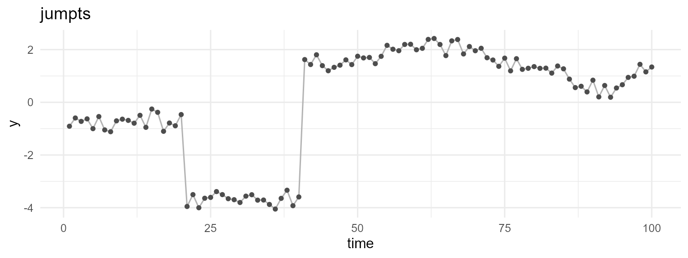

A first-order random walk models the series through its increments,
``` math
x_i - x_{i-1} \sim N(0,\,1/\tau),
```
which is the operator $`\mathbf D = \sqrt{\tau}\,\mathbf D_0`$ with
$`\mathbf D_0`$ the first-difference matrix. A Gaussian RW1 forces every
increment to share the same variance, so it cannot tell a jump from
ordinary noise. Fit it with INLA:

``` r

LGM <- inla(y ~ -1 + f(x, model = "rw1"), data = jumpts,
            control.compute = list(config = TRUE))
```

Now check whether the latent Gaussian assumption holds:

``` r

check <- ng.check(LGM, compute.fixed = FALSE)
```

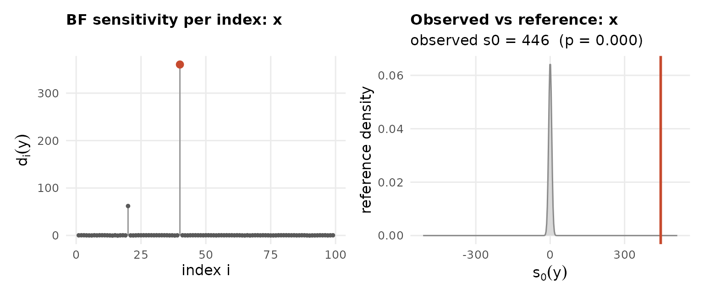

The left panel is the per-index sensitivity $`d_i(y)`$, which measures
how much the evidence would improve if increment $`i`$ were allowed to
be non-Gaussian. It spikes at the two jumps. The right panel compares
the observed overall sensitivity $`s_0=\sum_i d_i`$ (the vertical line)
against the distribution it would have under a truly Gaussian field (the
grey curve). The observed value sits far out in the tail, with
$`p\approx0`$, so the Gaussian RW1 is inadequate and we know exactly
where.

Now we extend it to non-Gaussianity. The model is auto-detected, so this
is a single call:

``` r

LnGM <- ngvb(LGM)
#> Components: x [rw1]
#> ngvb: converged after 24 iteration(s);  E[eta] = 3.742
plot(LnGM)
```

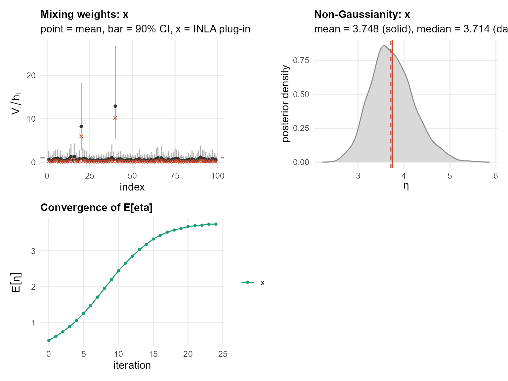

For each component the plot shows the mixing weights $`V_i/h_i`$ (the
posterior mean with a 90 percent credible interval, and a cross at the
plug-in value $`1/E[1/V_i]`$ that INLA is actually refit with, which
sits a little below the mean because $`q(V_i)`$ is right-skewed). The
final panel tracks $`E[\eta]`$ across the iterations. The mixing
variables are inflated precisely at the two jumps and sit near one
elsewhere, so the model bought local flexibility exactly where it was
needed and stayed Gaussian in between. The non-Gaussianity parameter is
clearly positive.

Beyond the point estimate, you can integrate the mixing variables V out
entirely by sampling from their variational posterior and refitting the
LGM at each draw. This gives the Bayes factor against the Gaussian
model, and, pooled with importance weights, posterior summaries of
anything the underlying inla() fit reports:

``` r

samples <- ngvb_sample(LnGM, n.samples = 30)
bayes.factor(samples)               # LnGM vs. LGM marginal-likelihood ratio
#> Bayes factor (non-Gaussian vs Gaussian): 9.95e+23
#>   log10 BF = 24.00  (decisive)
#>   weight ESS = 2.2 of 30 draws
summary(samples)                    # importance-weighted summaries, V integrated out
#> Latent non-Gaussian model, V integrated out over 30 draws
#> Bayes factor vs Gaussian model: 9.95e+23 (log10 = 24.00), weight ESS 2.2
#> 
#> Fixed effects:
#>   (none)
#> 
#> Hyperparameters:
#>                                              mean         sd
#> Precision for the Gaussian observations 3583.4354 13654.6354
#> Theta1 for x                               2.1163     0.4493
#> 
#> Random effects:
#>   $x (100 nodes)
#>   ID    mean     sd
#> 1  1 -0.8755 0.1419
#> 2  2 -0.6634 0.1094
#> 3  3 -0.7070 0.0956
#> 4  4 -0.6998 0.0999
#> 5  5 -0.8781 0.1213
#> 6  6 -0.7240 0.1306
#>   ... 94 more row(s); use what = "random" to print in full
```

On the usual scale a $`\log_{10}`$ Bayes factor above $`0.5`$, $`1`$, or
$`2`$ is substantial, strong, or decisive evidence for the non-Gaussian
model. Here it is far into the decisive range. The `ess` field is the
effective number of draws behind the estimate; if it is small, raise
`n.samples`.

## Geostatistical data: a Matern (SPDE) field

`weatherdata`, bundled with the package, holds pressure readings across
the Pacific Northwest. Build the mesh first and plot the stations over
it:

``` r

w    <- read.csv(system.file("extdata", "weatherdata.csv", package = "ngvb"))
mesh <- inla.mesh.2d(loc = w[, c("lon", "lat")], max.edge = c(1.5, 2.5),
                     cutoff = 0.3, max.n.strict = 400)
geo.plot(w[, c("lon", "lat", "press")], mesh = mesh, title = "pressure",
         palette = "RdBu")
```

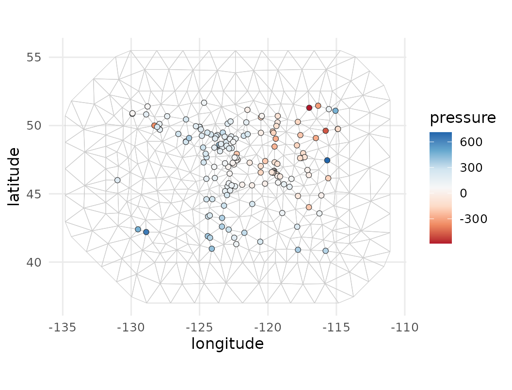

We model pressure as a continuous Matern field through the SPDE
approach, the standard tool for point-referenced spatial data. The field
solves a stochastic PDE whose finite-element form gives the operator
$`\mathbf D=\kappa^2\mathbf C+\mathbf G`$, where $`\mathbf C`$ and
$`\mathbf G`$ are the mass and stiffness matrices of the mesh. A
Gaussian Matern smooths the whole surface uniformly, while the
non-Gaussian version lets a few locations depart more sharply. `ngvb`
reads $`\mathbf D`$ straight from the fitted `spde` object, so you pass
nothing extra.

``` r

spde <- inla.spde2.pcmatern(mesh, alpha = 2,
                            prior.range = c(1, 0.5),    # P(range < 1) = 0.5
                            prior.sigma = c(10, 0.1))   # P(sigma > 1) = 0.01
A    <- inla.spde.make.A(mesh, loc = as.matrix(w[, c("lon", "lat")]))
stk  <- inla.stack(tag = "est", data = list(y = w$press), A = list(A),
                   effects = list(s = 1:spde$n.spde))

LGM <- inla(y ~ -1 + f(s, model = spde), data = inla.stack.data(stk),
            control.predictor = list(A = inla.stack.A(stk)),
            control.compute = list(config = TRUE))
```

``` r

chk <- ng.check(LGM, compute.random = TRUE)
```

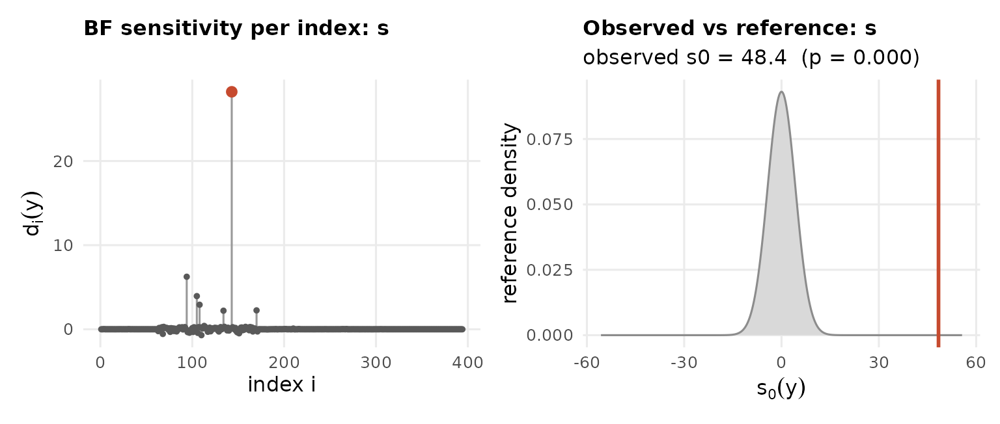

[`ng.check()`](https://rafaelcabral-ai.github.io/ngvb/reference/ng.check.md)’s
diagnostic $`d_i(y)`$ above is one instance of a more general result
(Theorem 2 of Cabral, Bolin & Rue, *JRSS-B* 2025): the sensitivity of
*any* posterior summary to relaxing Gaussianity is a covariance,
computable entirely from the Gaussian fit, without ever running
[`ngvb()`](https://rafaelcabral-ai.github.io/ngvb/reference/ngvb.md).
Two instances are built in: the sensitivity of a covariate’s coefficient
(`chk$sens.fixed`, one column per fixed effect) and the sensitivity of
the latent field’s own posterior mean at every node
(`chk$sens.random$s`, available because
[`ng.check()`](https://rafaelcabral-ai.github.io/ngvb/reference/ng.check.md)
was called with `compute.random = TRUE` above). So before ever fitting
the non-Gaussian model, we can already map where its predictions are
expected to move the most:

``` r

nodes.sens <- data.frame(lon = mesh$loc[, 1], lat = mesh$loc[, 2], sens = chk$sens.random$s)
geo.plot(nodes.sens, mesh = mesh, title = "sensitivity of posterior mean", palette = "RdBu")
```

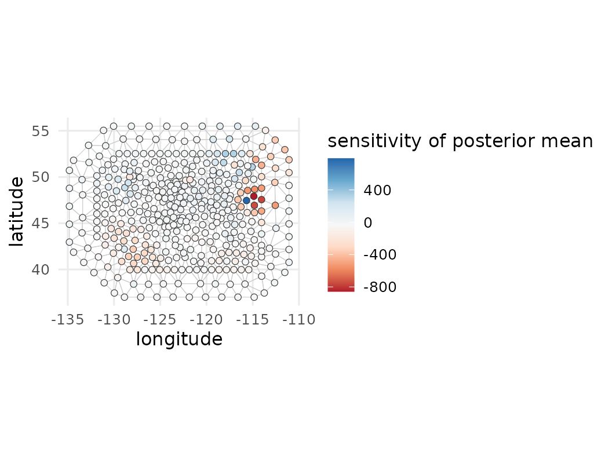

This map is computed entirely from the Gaussian fit above;
[`ngvb()`](https://rafaelcabral-ai.github.io/ngvb/reference/ngvb.md) has
not run yet. We can tell which regions our spatial predictions will
change the most, and also the direction. Blue means that the posterior
mean of the latent field will take larger values once we fit the
non-Gaussian model.

``` r

LnGM <- ngvb(LGM)
#> Components: s [spde]
#> ngvb: reached the iteration limit after 30 iteration(s);  E[eta] = 0.096
plot(LnGM)
```

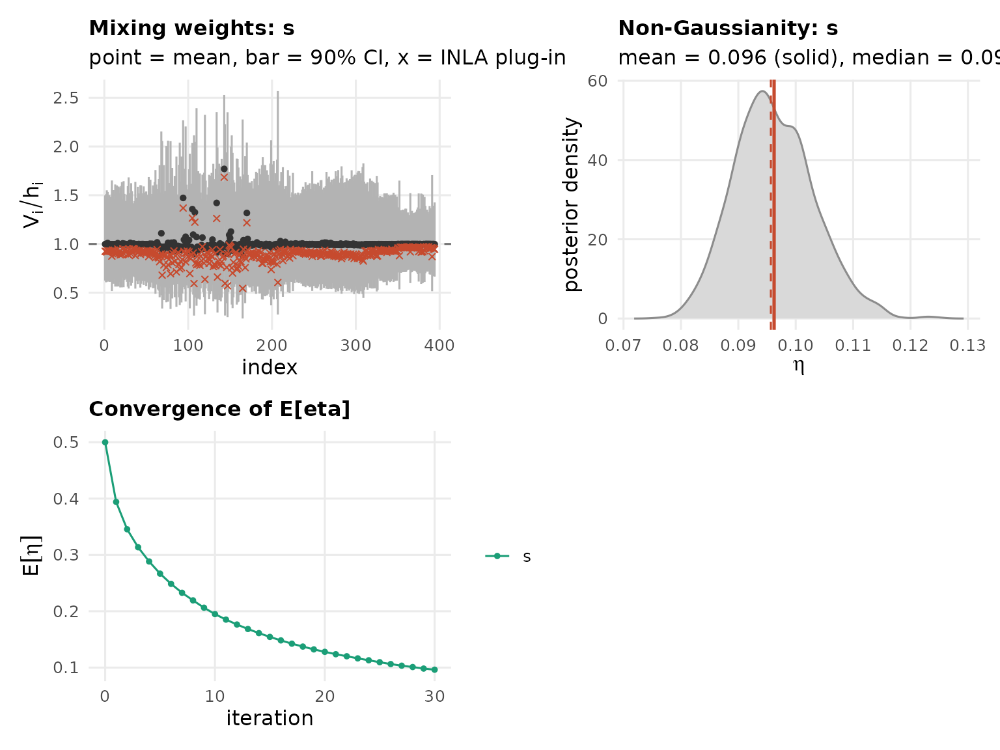

The mixing variables live on the mesh nodes, so we can map them back
over space. We plot the ratio $`V_i/h_i`$, which is one where the field
is Gaussian and larger where it departs from a uniform Matern (for the
SPDE the weights $`h_i`$ are the mesh mass, so $`V_i/h_i`$ rather than
$`V_i`$ is the quantity to look at):

``` r

nodes <- data.frame(lon = mesh$loc[, 1], lat = mesh$loc[, 2],
                    Vh = LnGM$V$s / LnGM$h$s)
geo.plot(nodes, mesh = mesh, title = "V/h")
```

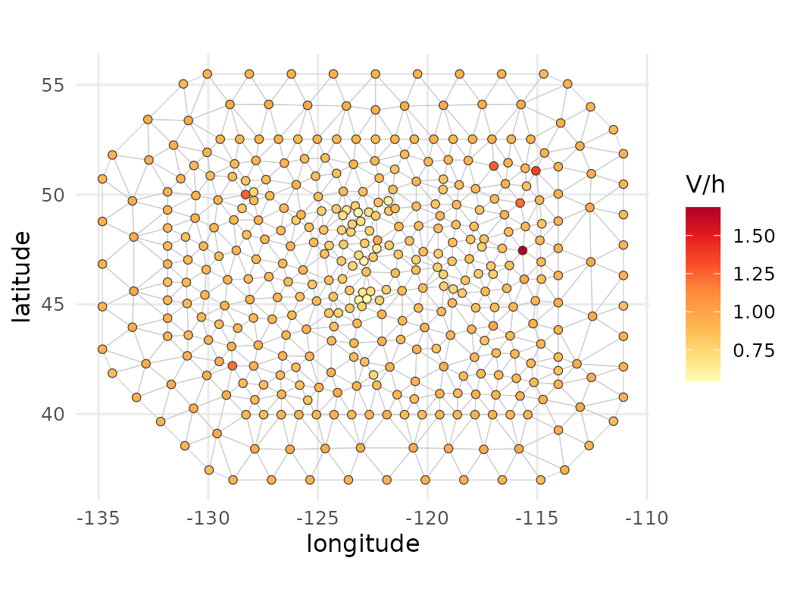

``` r

samples <- ngvb_sample(LnGM, n.samples = 30, seed = 1)
bayes.factor(samples)
#> Bayes factor (non-Gaussian vs Gaussian): 47.1
#>   log10 BF = 1.67  (strong)
#>   weight ESS = 12.9 of 30 draws
```

[`ngvb_sample()`](https://rafaelcabral-ai.github.io/ngvb/reference/ngvb_sample.md)
also pools the latent field itself through
`summary(samples, what = "random")`, so we can now compare the
sensitivity preview above against the actual before/after change in the
posterior mean:

``` r

post    <- summary(samples, verbose = FALSE)

diff <- post$random$s$mean - LGM$summary.random$s$mean
nodes.diff <- data.frame(lon = mesh$loc[, 1], lat = mesh$loc[, 2], diff = diff)
geo.plot(nodes.diff, mesh = mesh, title = "LnGM - LGM (posterior mean)", palette = "RdBu")
```

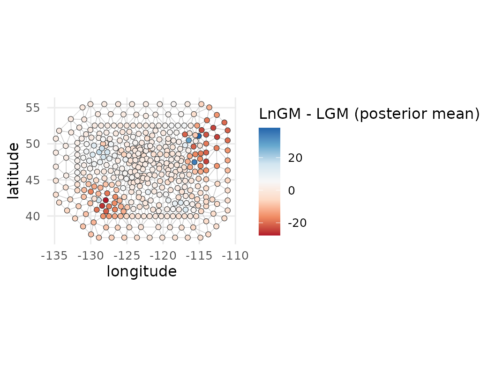

The two maps pick out the same location. The sensitivity preview
correlates with the actual change in magnitude, and among the handful of
nodes it flags as most sensitive the direction agrees too:

``` r

cat(sprintf("correlation(sensitivity, actual change) = %.2f\n",
            cor(chk$sens.random$s, diff)))
#> correlation(sensitivity, actual change) = 0.78
top10 <- order(-abs(chk$sens.random$s))[1:20]
cat(sprintf("sign agreement among the 20 most sensitive nodes: %.0f%%\n",
            100 * mean(sign(chk$sens.random$s[top10]) == sign(diff[top10]))))
#> sign agreement among the 20 most sensitive nodes: 100%
```

## Random intercepts and slopes

`Orthodont` records a growth measurement for 27 children at four ages,
together with a sex indicator and time coded two ways. A quick look at
the raw data frame:

``` r

Orthodont$age <- c(8, 10, 12, 14)[Orthodont$time + 1]

ggplot(Orthodont, aes(x = age, y = value)) +
  geom_line(color = "#007fff") +
  geom_point(shape = 1, color = "#007fff") +
  scale_x_continuous(breaks = c(9, 11, 13)) + 
  facet_wrap(~ ifelse(Female == 1, paste0("F", subject), paste0("M", subject)), ncol = 11) +
  theme_bw() +
  theme(panel.spacing = unit(0, "lines"),
        strip.background = element_rect(fill = "#ffe5cc"))
```

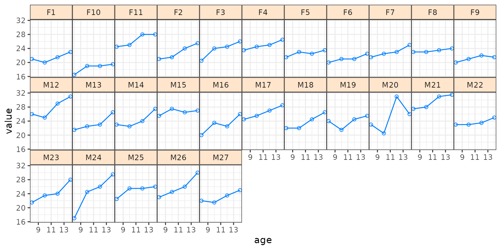

Two kinds of child-to-child variation matter here. Each child starts at
a different height, which is variation in the intercept, and each child
grows at a slightly different rate, which is variation in the slope. We
give every child its own intercept and its own slope, as two `iid`
random effects:
``` math
\text{value}_{ij} = \beta_0 + \beta\,\text{covariates}
   + \underbrace{a_{\text{subject}(ij)}}_{\text{random intercept}}
   + \underbrace{b_{\text{subject}(ij)}\,\text{time}_{ij}}_{\text{random slope}}
   + \varepsilon_{ij},
```
with $`a_k \sim N(0, 1/\tau_a)`$ and $`b_k \sim N(0, 1/\tau_b)`$ across
children.

``` r

formula <- value ~ 1 + Female + time + tF +
  f(subject,  model = "iid") +      # random intercept, one per child
  f(subject2, time, model = "iid")  # random slope, one per child

LGM <- inla(formula, data = Orthodont, control.compute = list(config = TRUE))
```

Why make the random effects non-Gaussian? A Gaussian random effect
treats the children as exchangeable draws from one normal distribution.
If a child or two are genuine outliers, with an unusually high baseline
for example, the Gaussian either shrinks them toward the mean and hides
the outlier, or it widens the distribution for everyone to accommodate
them. A non-Gaussian random effect keeps a tight distribution for the
typical children and lets the few outliers stand out.
[`ng.check()`](https://rafaelcabral-ai.github.io/ngvb/reference/ng.check.md)
reports one diagnostic per component:

``` r

ng.check(LGM, compute.fixed = FALSE)
```

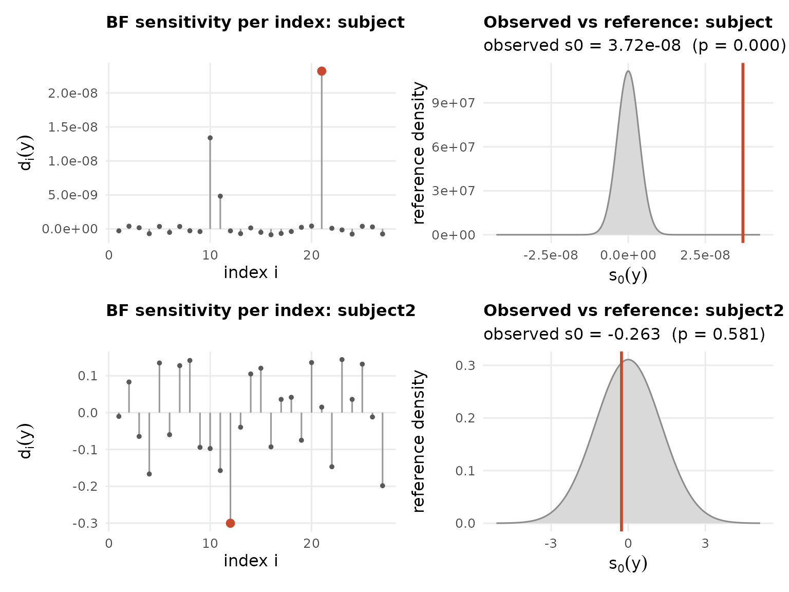

We see that no substancial evidence of non-Gaussianity was found (small
$`p`$) for both random effects.

``` r

LnGM <- ngvb(LGM)
#> Components: subject [iid], subject2 [iid]
#> ngvb: reached the iteration limit after 30 iteration(s);  E[eta] = 0.130, 0.203
plot(LnGM)
```

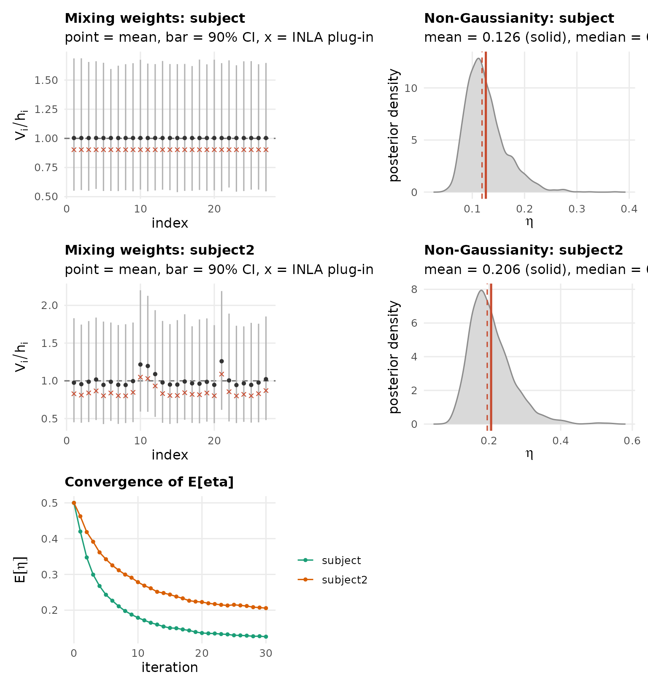

After fitting the latent non-Gaussian model we see that the intercept
carries more non-Gaussianity than the slope. A couple of children have
outlying baselines, while the growth rates are close to Gaussian.

``` r

bayes.factor(LnGM, n.samples = 30, seed = 1)
#> Bayes factor (non-Gaussian vs Gaussian): 7.88e+05
#>   log10 BF = 5.90  (decisive)
#>   weight ESS = 3.1 of 30 draws
```

## Areal data: an intrinsic model (besag)

Residential burglary rates in 49 counties of Columbus, Ohio, come with
the `spData` package. Plot the response on the map first:

``` r

library(sf); library(spdep)
map  <- st_read(system.file("shapes/columbus.gpkg", package = "spData"), quiet = TRUE)
areal.plot(map, map$CRIME, title = "crime")
```

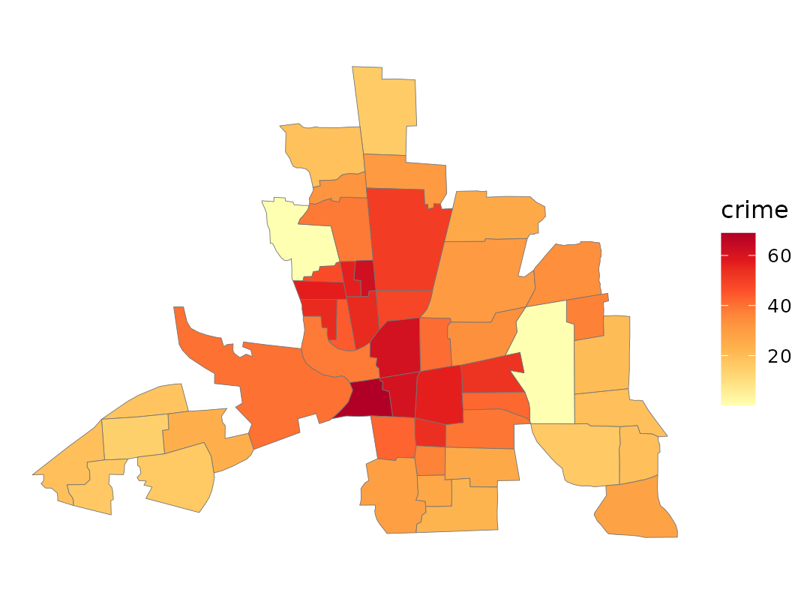

An intrinsic conditional autoregression (the `besag` model) assumes
neighbouring counties are similar, with Gaussian differences across the
edges of the adjacency graph,
``` math
x_i - x_j \sim N(0,\,1/\tau)\quad\text{for each edge }(i,j).
```
The non-Gaussian version allows a few sharp boundaries between otherwise
smooth regions. Build the adjacency and fit the Gaussian model:

``` r

d    <- st_drop_geometry(map[, c("CRIME", "HOVAL", "INC")])
d$s  <- seq_len(nrow(d))
nb   <- poly2nb(map)
Wadj <- Matrix::sparseMatrix(i = rep(seq_along(nb), lengths(nb)), j = unlist(nb), x = 1)

LGM <- inla(CRIME ~ 1 + HOVAL + INC +
              f(s, model = "besag", graph = Wadj, scale.model = TRUE,
                hyper = list(prec = list(prior = "loggamma", param = c(0.5, 0.01)))),
            data = d, control.compute = list(config = TRUE))
```

``` r

LGM$summary.hyperpar
#>                                               mean           sd  0.025quant
#> Precision for the Gaussian observations  0.0080316  0.001644847 0.005242204
#> Precision for s                         57.1638799 89.632926477 1.289090539
#>                                             0.5quant   0.975quant        mode
#> Precision for the Gaussian observations  0.007880677   0.01168902 0.007604842
#> Precision for s                         27.942104820 284.83005906 2.349096011
```

``` r

ng.check(LGM, compute.fixed = FALSE)   # areal model auto-detected
```

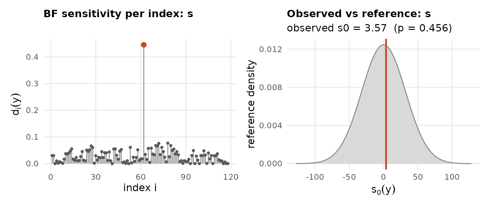

The 118 edges of this graph all show a similarly small discrepancy from
the Gaussian reference. This field is essentially Gaussian, and both the
previous checking procedure (`ng.check`) and the latent non-Gaussian
fitting (`ngvb`) show that.

``` r

LnGM <- ngvb(LGM)
#> Components: s [car]
#> ngvb: reached the iteration limit after 30 iteration(s);  E[eta] = 0.073
plot(LnGM)
```

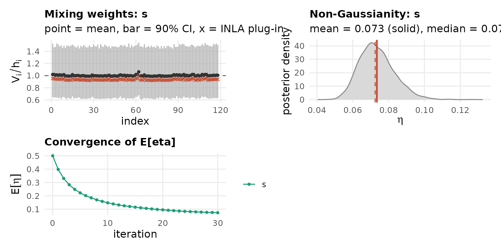

``` r

bayes.factor(LnGM, n.samples = 30, seed = 1)
#> Bayes factor (non-Gaussian vs Gaussian): 1.04
#>   log10 BF = 0.02  (weak/none)
#>   weight ESS = 25.6 of 30 draws
```

## Your own precision matrix with ngvb_custom

If a model is not built in, you can supply the dependency matrix
$`\mathbf D(\boldsymbol\theta)`$ and the constant vector $`\mathbf h`$
yourself with
[`ngvb_custom()`](https://rafaelcabral-ai.github.io/ngvb/reference/ngvb_custom.md).
The engine then forms
$`\mathbf Q(\mathbf V)=\mathbf D^\top\mathrm{diag}(1/\mathbf V)\mathbf D`$,
owns its normalizing constant, and
[`ng.check()`](https://rafaelcabral-ai.github.io/ngvb/reference/ng.check.md)
and [`ngvb()`](https://rafaelcabral-ai.github.io/ngvb/reference/ngvb.md)
work exactly as before.

For areal data the natural custom model is the simultaneous
autoregression (SAR), which uses
``` math
\mathbf D_{\mathrm{SAR}}=\sqrt{\tau}\,(\mathbf I-\rho\mathbf W),\qquad |\rho|<1,
```
with $`\mathbf W`$ a row-standardised adjacency. This is worth
stressing: among areal models, the SAR is the one you build through
[`ngvb_custom()`](https://rafaelcabral-ai.github.io/ngvb/reference/ngvb_custom.md).
A proper CAR, or the intrinsic besag/ICAR family, cannot be written as a
custom $`\mathbf D`$ of this kind, because their precisions are
specified conditionally or intrinsically rather than through a whitening
operator with a fixed sparsity pattern. The intrinsic besag model is
instead available by auto-detection, as in the previous section, and
there is no way to hand it to
[`ngvb_custom()`](https://rafaelcabral-ai.github.io/ngvb/reference/ngvb_custom.md)
as a bespoke operator. So for a custom areal model, think SAR.

Unlike the intrinsic besag effect, the SAR mixing variables live on the
counties themselves, so we can map them directly.

Here is the full definition, and each argument is explained just below
it.

``` r

W      <- Matrix::Diagonal(x = 1 / rowSums(Wadj)) %*% Wadj    # row-standardise
N      <- nrow(W)
eigenv <- Re(eigen(as.matrix(W), only.values = TRUE)$values)

op_sar <- ngvb_custom(
  D = function(theta) {
    rho <- exp(theta[2]) / (1 + exp(theta[2]))
    sqrt(exp(theta[1])) * (Matrix::Diagonal(N) - rho * W)
  },
  h        = rep(1, N),
  ntheta   = 2,
  logprior = function(theta) {
    rho <- exp(theta[2]) / (1 + exp(theta[2]))
    stats::dnorm(theta[1], 0, 3, log = TRUE) + log(rho) + log(1 - rho)
  },
  lognc = function(theta, Vinv) {
    rho <- exp(theta[2]) / (1 + exp(theta[2]))
    0.5 * N * theta[1] + sum(log(1 - rho * eigenv)) +
      0.5 * sum(log(Vinv)) - 0.5 * N * log(2 * pi)
  })
```

The arguments are:

- `D = function(theta)` builds the dependency matrix
  $`\mathbf D(\boldsymbol\theta)`$ as a sparse `Matrix`. Its rows are
  the driving-noise terms and its columns are the latent nodes. Here
  `theta[1]` is the log precision and `theta[2]` is the internal
  (unconstrained) version of $`\rho`$, mapped into $`(0,1)`$ by the
  logistic function. INLA works on this internal scale, which is why the
  transform appears inside `D`.
- `h` is the constant vector with $`E[V_i]=h_i`$, and $`V=h`$ recovers
  the Gaussian model. For a discrete areal model there is one innovation
  per node, so `h` is a vector of ones.
- `ntheta` is the number of hyperparameters that INLA estimates, here
  two.
- `logprior = function(theta)` is the log prior density of the
  hyperparameters, written on the internal scale and including any
  change-of-variables Jacobian. This is the piece INLA adds to the
  log-posterior for $`\boldsymbol\theta`$. In this example there is a
  $`N(0,3)`$ prior on the log precision, and a uniform prior on
  $`\rho\in(0,1)`$; after the logistic transform the uniform density
  contributes the Jacobian term $`\log\rho + \log(1-\rho)`$. If you omit
  `logprior`, an independent $`N(0,3)`$ on each internal hyperparameter
  is used.
- `lognc = function(theta, Vinv)` is optional but recommended when
  $`\mathbf D`$ can get close to singular, as it does here when $`\rho`$
  approaches one. It returns the log normalizing constant of the
  conditional Gaussian density,
  $`\tfrac12\log|\mathbf Q(\boldsymbol\theta,\mathbf V)| - \tfrac{n}{2}\log(2\pi)`$,
  and it receives `Vinv` $`=1/\mathbf V`$ so that the
  $`\mathbf V`$-dependent part of the determinant is included. For the
  SAR the log-determinant has the closed form
  $`N\log\tau + 2\sum_i\log(1-\rho\lambda_i) + \sum_i\log(1/V_i)`$,
  using the eigenvalues $`\lambda_i`$ of $`\mathbf W`$, which is both
  fast and stable near the boundary. When `lognc` is omitted, the engine
  computes the determinant generically, which is fine for
  well-conditioned operators.

A couple of practical notes. `D`, `logprior`, and `lognc` are evaluated
in a separate R process where only the base packages are attached, so
any non-base function must be namespace-qualified, which is why the code
writes
[`Matrix::Diagonal`](https://rdrr.io/pkg/Matrix/man/Diagonal.html) and
[`stats::dnorm`](https://rdrr.io/r/stats/Normal.html), and uses
`exp(t)/(1+exp(t))` rather than `plogis`. The data those functions
reference, such as `W` and `eigenv`, is captured automatically.

With the operator defined, fit the Gaussian SAR through the same engine
and then extend it:

``` r

LGM  <- inla(CRIME ~ 1 + HOVAL + INC + f(s, model = ngvb_rgeneric(op_sar)),
             data = d, control.compute = list(config = TRUE))
LnGM <- ngvb(LGM, components = list(s = op_sar), verbose = FALSE)
plot(LnGM)
```

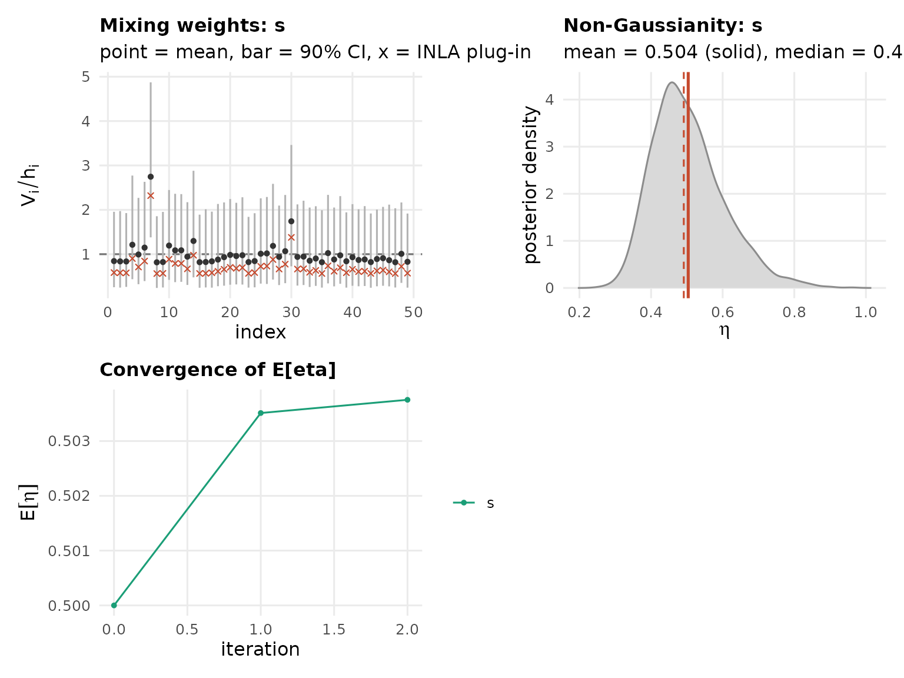

Because the SAR weights live on the counties, we can put them straight
back on the map. Low values are yellow and high values are red, so the
reddest counties are where the model added the most flexibility, meaning
the largest local departures from the smooth spatial field:

``` r

areal.plot(map, LnGM$V$s, title = "V")
```

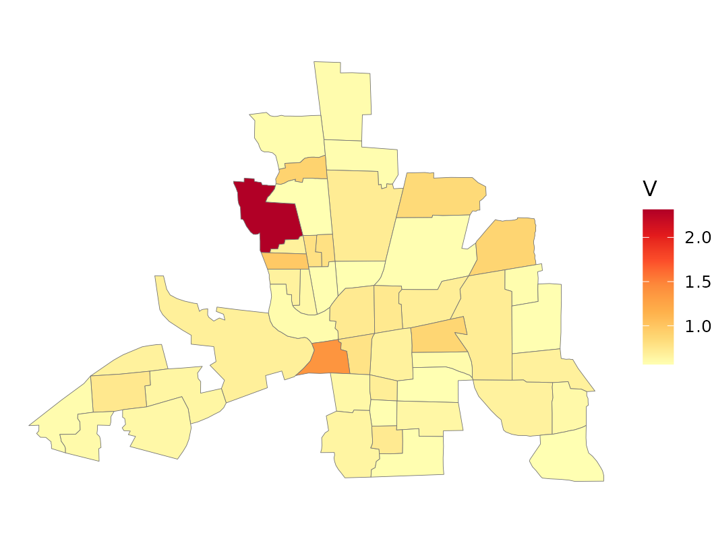

``` r

bayes.factor(LnGM, n.samples = 30, seed = 1)
#> Bayes factor (non-Gaussian vs Gaussian): 9.59
#>   log10 BF = 0.98  (substantial)
#>   weight ESS = 15.4 of 30 draws
```

That is the whole custom interface. Give
[`ngvb_custom()`](https://rafaelcabral-ai.github.io/ngvb/reference/ngvb_custom.md)
a function `D(theta)` and a vector `h`, optionally a prior and a
normalizing constant, and any Gaussian model whose precision factors as
$`\mathbf D^\top\mathrm{diag}(1/\mathbf h)\mathbf D`$ becomes a latent
non-Gaussian one.

## Using operators from the ngme2 package

The [ngme2](https://davidbolin.github.io/ngme2/) package is a good
source of ready-made dependency matrices for models beyond ngvb’s own
registry (general AR(p), tensor-product and bivariate operators among
them). Its operator objects expose $`K(theta_K)`$, the dependency matrix
D you need, as a function of a hyperparameter, and $`h`$. For an AR(1)
field, for example:

``` r

ngme_ar1 <- ngme2::ar1(1:N)

op_ar1_ngme2 <- ngvb_custom(
  D = function(theta) sqrt(exp(theta[1])) * ngme_ar1$update_K(theta[2]),
  h        = ngme_ar1$h,
  ntheta   = 2,
  logprior = function(theta) {
    stats::dnorm(theta[1], 0, 3, log = TRUE) +   # precision: your choice
    stats::dnorm(theta[2], 0, 1, log = TRUE)     # matches ngme2's own prior_normal(0, 1) on theta_K
  })
```

`theta[1]` is your own added precision hyperparameter; `theta[2]` is
passed straight through to ngme2’s `update_K`, which applies its own
internal transform to it.
